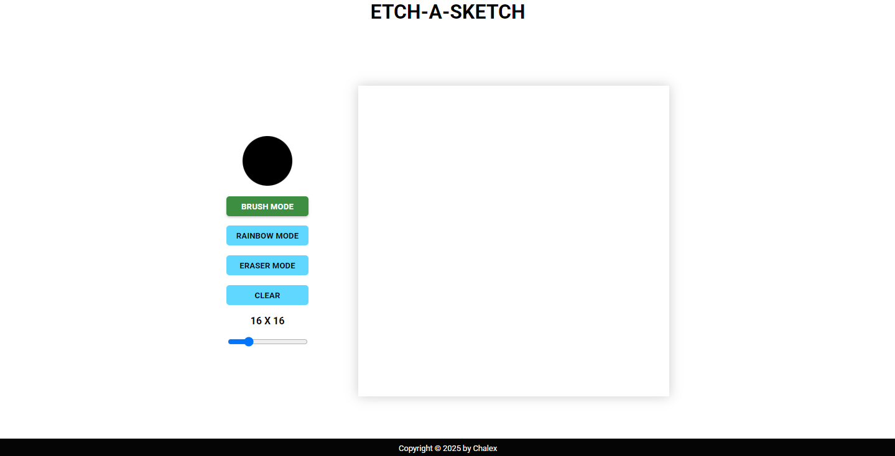
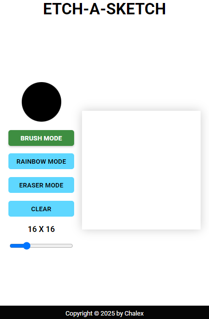

# Etch A Sketch Website

Welcome to the **Etch A Sketch Website**! This is a fun and interactive drawing tool inspired by the classic toy, built using HTML, CSS, and JavaScript. You can draw, erase, use rainbow colors, and customize the grid size to your liking.

## Features

-   **Color Picker**: Choose any color for your brush.
-   **Brush Mode**: Use a solid color to draw on the grid.
-   **Rainbow Mode**: Draw with random colors for each cell.
-   **Eraser Mode**: Erase parts of your drawing.
-   **Clear Button**: Clear the entire grid with one click.
-   **Grid Size Customization**: Adjust the grid size from 1x1 to 64x64.
-   **Responsive Design**: Works seamlessly on desktop and mobile devices.

## Technologies Used

-   **HTML**: Markup for the structure of the website.
-   **CSS**: Styling and layout, including responsiveness.
-   **JavaScript**: Dynamic functionalities such as drawing, erasing, and grid customization.

## How to Use

1. Open the website in a browser.
2. Use the **grid size slider** to select the desired grid size.
3. Pick a color using the **color picker**.
4. Click **Brush Mode** to draw with the selected color.
5. Click **Rainbow Mode** to draw with random colors.
6. Click **Eraser Mode** to erase parts of your drawing.
7. Click **Clear** to reset the grid.

## Screenshots

### Desktop View



### Mobile View



## Project Structure

```plaintext
|-- index.html      # Main HTML file
|-- style.css       # Styling for the website
|-- reset.css       # CSS reset for consistent styling
|-- script.js       # JavaScript for functionality
```

## Installation

1. Clone the repository:

    ```bash
    git clone https://github.com/chachaa10/etch-a-sketch.git
    ```

2. Open `index.html` in any modern browser.

## Live Demo

Check out the live version of the website **[here](https://chachaa10.github.io/etch-a-sketch/)**.


## Future Improvements

-   Add an option to save the drawing as an image.
-   Implement a "light/dark mode" toggle for the interface.
-   Include keyboard shortcuts for faster mode switching.

## Credits

Developed by **Chalex**. Special thanks to Odin Projects for providing the inspiration and resources for this project.

---

Feel free to reach out with suggestions or contributions!
